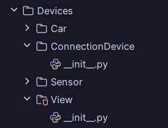

<p align="center">
  
</p>
<h1 align="center">Internet das Coisas (IoT)</h1>
<h3 align="center">Projeto de Conexão de Dispositivos IoT através de Broker e API RESTful</h3>

<div align="justify"> 
<div id="sobre-o-projeto"> 
<h2> Descrição do Projeto</h2>

A Internet das Coisas (*Internet of Things*, IoT) representa uma revolução tecnológica ao conectar dispositivos à 
internet, transformando nossa interação com o mundo e prometendo inovação e eficiência em diversos setores. 
Em resposta a essa importância, este projeto propõe o desenvolvimento de um serviço que facilite a comunicação entre 
dispositivos e aplicações dependentes de seus dados, além de possibilitar o controle desses dispositivos.

O sistema será implementado por um serviço de *broker*, permitindo a troca de mensagens entre os clientes do
servidor utilizando subsistemas de rede **TCP/IP**. Dessa forma, o projeto se estrutura em três entidades distintas, 
cada uma com requisitos específicos:

- **Aplicação de controle:** Uma interface intuitiva que permita o controle remoto de dispositivos e a visualização dos dados gerados por eles.
- **Dispositivo virtual:** Deve garantir uma abordagem confiável para o gerenciamento de dados e uma abordagem não confiável para o envio de dados. Além disso, deve oferecer uma interface de controle para gerenciar o dispositivo localmente.
- **Servidor broker:** Implementação de uma **API RESTful** que viabilize a troca de dados e comandos entre a aplicação e os dispositivos, garantindo uma comunicação eficiente e segura.

</div>
</div>

<h2> Autor <br></h2>
<uL>
  <li><a href="https://github.com/TAlmeida003">Thiago Neri dos Santos Almeida</a></li>
</ul>

<h1 align="center"> Sumário </h1>
<div id="sumario">
	<ul>
        <li><a href="#Software"> Softwares Utilizadas </a></li>
        <li><a href="#Broker"> Broker e Dispositivos </a></li>
        <li><a href="#Conectividade"> Interface de Rede </a></li>
        <li><a href="#API"> API RESTful </a></li>
        <li><a href="#usuario"> Aplicação de Controle iot</a></li>
        <li><a href="#logica"> Lógica de Funcionamento do Projeto</a></li>
        <li><a href="#conclusao"> Conclusão </a></li>
        <li><a href="#execucaoProjeto"> Execução do Projeto </a></li>
        <li><a href="#referencias"> Referências </a></li>
	</ul>	
</div>


<div id="Software">
<h2> Softwares Utilizadas</h2>
<div align="justify">

Nesta seção, são apresentados os softwares utilizados durante o desenvolvimento do projeto.

<h3> Linguagem Python</h3>

A linguagem *Python* foi escolhida devido à sua facilidade de aprendizado e flexibilidade. 
Sua sintaxe limpa e legível permite a rápida prototipagem de ideias e o desenvolvimento ágil de aplicações. 
Além disso, *Python* é reconhecido pela sua vasta gama de bibliotecas e frameworks que facilitam o desenvolvimento 
em diversas áreas. É importante ressaltar que a versão utilizada foi a 3.12.2.

<h3> Biblioteca Flask</h3>

A biblioteca *Flask* é um módulo para construção de aplicações web em *Python*. Ela oferece flexibilidade 
para o desenvolvimento de APIs, permitindo a criação de endpoints RESTful e o gerenciamento de rotas HTTP.

<h3> Biblioteca Requests</h3>

A biblioteca Requests é uma ferramenta para fazer requisições HTTP em *Python*. Ela oferece uma 
interface que simplifica o processo de envio e recebimento de dados pela internet, tornando a 
comunicação com APIs mais eficiente.

<h3> Docker</h3>

O *Docker* é uma plataforma de implantação e execução de aplicativos em contêineres. 
Um contêiner é uma unidade leve e portátil que inclui tudo o que um aplicativo precisa 
para ser executado de forma independente, como código, bibliotecas, dependências e configurações.
O Docker oferece uma plataforma consistente para desenvolver, testar e implantar aplicativos, 
garantindo que os ambientes de desenvolvimento e produção sejam consistentes e reproduzíveis.

<h3>IDE PyCharm</h3>

A IDE *PyCharm* é um ambiente de desenvolvimento integrado projetado especificamente para *Python*. O *PyCharm* oferece uma 
ampla gama de recursos para aumentar a produtividade dos desenvolvedores, incluindo realce de sintaxe avançado, 
completamento automático de código, depuração integrada e suporte para controle de versão. Além disso, o PyCharm possui
integração com o *Docker*, facilitando o desenvolvimento e a implantação de aplicativo *Python* em diversos ambientes.

<h3> Insomnia </h3>

O *Insomnia* é uma ferramenta usada para testar APIs e atuar como cliente REST, simplificando o desenvolvimento de APIs.
Com ele, os desenvolvedores podem criar, testar e depurar suas APIs de maneira eficiente, oferecendo suporte a 
diferentes métodos de requisição, autenticação, gerenciamento de variáveis e até mesmo a criação de fluxos de trabalho 
complexos.

</div>
</div>

<div id="Broker">
<h2> Broker e Dispositivos</h2>
<div align="justify">

Nessa seção, será apresentado a lógica de funcionamento do *broker* e dos dispositivos desenvolvidos.

<h3> Broker</h3>

O *broker* é uma tecnologia que desempenha o papel de intermediário na comunicação entre diferentes sistemas ou
dispositivos. No contexto deste projeto, o broker foi utilizado como um mensageiro, atuando como um servidor 
centralizado onde os dispositivos e a aplicação do usuário se conectam para enviar e receber mensagens.

Para gerenciar esses dispositivos, o *broker* utiliza uma estrutura de dados que organiza todos os dispositivos com base
em seus endereços IP, permitindo a diferenciação entre eles. Além disso, foram utilizados elementos de programação,
como o uso de *threads* e cache de dados, para otimizar o desempenho do *broker*. Esses tópicos serão abordados em detalhes
posteriormente.

As requisições do aplicação do usuário ao *broker* são feitas por meio de uma interface de API RESTful, que se comunica 
com os elementos do *broker* para gerenciar as conexões de cada dispositivo de forma eficiente.

No projeto, o *broker* é composto por três arquivos principais: o arquivo do servidor (<code>Server/__init__.py</code>),
que contém os métodos de controle e gerenciamento do servidor; a API (<code>API.py</code>), responsável por utilizar as
funções do servidor e criar os *endpoints* para acesso HTTP; e o arquivo principal (<code>__main__.py</code>), onde esses
dois arquivos são inicializados. A distribuição dos arquivos no diretório do broker é mostrada na imagem.

<p align="center">
  
</p>
<p align="center"><strong>Organização de arquivos relacionados ao broker</strong></p>

Ao iniciar o *broker*, é exibido uma mesagem avisando que o servidor foi iniciado e está aguardando conexões. Além disso,
é mostrado o endereço IP e a porta do servidor, essenciais para a conexão dos dispositivos e da aplicação do usuário.

<p align="center">
  
</p>
<p align="center"><strong>Interface de controle do broker</strong></p>

<h3> Dispositivos</h3>

Para simular os dispositivos no ambiente de software, foram empregados dois dispositivos virtuais: um sensor
de temperatura e umidade, e um veículo (carro). Aqui, exploraremos como esses dispositivos são controlados tanto
localmente, por meio de sua interface de controle, quanto remotamente.

<h4> Sensor</h4>

Este dispositivo emula um sensor iot fictício, replicando o comportamento de um sensor real de temperatura e umidade. 
Em sua interface de controle, o sensor oferece o controle das seguintes características:


- **Controle de estado:** Permite ligar o sensor ou colocá-lo em modo de espera, que é essencialmente uma forma de desligamento parcial, mantendo-o pronto para ser ativado novamente;

- **Controle de dados:** Possibilita a alteração da temperatura (com controle de 5 a 60 °C) e da umidade (com controle de 20 a 80 por cento);

- **Controle de conectividade:** Facilita a conexão e desconexão do *broker*;
- **Visualização de dados:** Fornece informações como o endereço IP do dispositivo, o número de threads ativas e o registro de envio e recebimento de dados.

<p align="center">
  
</p>
<p align="center"><strong>Interface de controle do sensor</strong></p>

<p align="center">
  
</p>
<p align="center"><strong>Interface de visualização de dados em tempo real do sensor</strong></p>

O sensor também é projetado para ser controlado remotamente. Por comandos específicos, é possível alterar seus estados e também solicitar a transmissão de dados. Cada comando possui uma função específica e uma maneira distinta de resposta, detalhadas posteriormente. Segue abaixo uma tabela que apresenta cada um dos comandos disponíveis, sua forma de resposta (UDP ou TCP), e o protocolo padrão utilizado para chamá-lo via HTTP:

<div align="center">

| Comando     	      | Resposta  | Protocolo HTTP |
|--------------------|-----------|----------------|
| ligar  	           | TCP       | POST	          |
| desligar 	         | TCP       | POST	          |
| temperatura-atual	 | UDP       | GET	           |
| umidade-atual	     | UDP       | GET	           |
| reiniciar 	        | TCP       | POST	          |
| definir-nome       | TCP       | POST	          |

</div>

<p align="center">
<strong> Tabela com os comando remotos do sensor</strong> </p>

<h4> Carro </h4>

O Carro é responsável por simular um veículo IoT, replicando diversos comportamentos de um carro real. Em sua interface de controle, oferece funcionalidades semelhantes ao sensor, como controle de estado, controle de conectividade e visualização de dados. Além disso, inclui outras características:

- **Controle de dados:** Permite definir a velocidade de movimentação (de 0 a 220 km/h), o nível de bateria (de 0 a 100%), e a quantidade de gasolina (de 0 a 55 litros).
- **Controle de estados:** Possibilita travar e destravar as portas, selecionar a direção de movimentação (para frente, para trás e parar), iniciar o movimento, e ativar ou desativar o sensor de colisão.
- **Visualização de dados:** Apresenta a ficha técnica do carro, incluindo modelo e ano de fabricação, por exemplo. Quando em movimento, exibe a distância percorrida a partir do ponto de origem, juntamente com todos os atributos do veículo.

<p align="center">
  
</p>
<p align="center"><strong>Interface de controle do Carro</strong></p>

<p align="center">
  
</p>
<p align="center"><strong>Interface de visualização de dados em tempo real do carro</strong></p>

O carro também é capaz de ser gerenciado remotamente, compartilhando características semelhantes ao sensor. Nesse contexto, uma tabela é apresentada para ilustrar os comandos de controle remoto do carro, indicando se a resposta é em UDP ou TCP, e qual protocolo HTTP é utilizado para acessá-los:

<div align="center">

| Comando             | Resposta               | Protocolo HTTP |
|---------------------|------------------------|----------------|
| ligar               | TCP                    | POST           |
| desligar            | TCP                    | POST           |
| get-velocidade      | UDP                    | GET            |
| definir-velocidade  | TCP                    | POST           |
| travar-porta        | TCP                    | POST           |
| destravar-porta     | TCP                    | POST           |
| ir-para-frente      | TCP                    | POST           |
| ir-para-tras        | TCP                    | POST           |
| parar               | TCP                    | POST           |
| iniciar-movimento   | TCP                    | POST           |
| ativar-buzina       | TCP                    | POST           |
| desativar-buzina    | TCP                    | POST           |
| medir-distancia     | UDP                    | GET            |
| status              | UDP                    | GET            |
| get-gasolina        | UDP                    | GET            |
| get-bateria         | UDP                    | GET            |
| get-colisao         | UDP                    | GET            |

</div>

<p align="center">
<strong> Tabela com os comando remotos do carro </strong> </p>

<h4>Organização do código</h4>

No projeto, os dispositivos seguem uma lógica semelhante de organização. Cada dispositivo é representado por uma classe que encapsula os métodos de comunicação direta com o broker, como envio, recebimento e conexão (`ConnectionDevice.__init__.py`). Além disso, existe um arquivo de comunicação (`Communication.py`) que controla os envios a partir das requisições do broker, lidando com as peculiaridades de comunicação de cada dispositivo.

Na lógica de negócios, dentro de cada pasta de dispositivo, encontramos uma classe com o nome correspondente ao dispositivo (por exemplo, `Car.__init__.py` ou `Sensor.__init__.py`). Essas classes são responsáveis por definir o comportamento específico de cada dispositivo.

Finalmente, há as classes de interface de usuário (`User.py`) e visualização (`View.__init__.py`), que são encarregadas de lidar com as impressões e entradas relacionadas a cada dispositivo.

O arquivo principal (`__main__.py`) atua como o ponto de entrada do programa, coordenando e integrando todos os outros arquivos e funcionalidades. As proximas imagens mostram a árvore de diretorios e arquivos dos dispositivos:

<p align="center">
  
</p>
<p align="center"><strong>Organização de arquivos relacionados aos dispositivos</strong></p>

<p align="center">
  
</p>
<p align="center"><strong>Organização de arquivos relacionados ao dispositivo carro</strong></p>

<p align="center">
  
</p>
<p align="center"><strong>Organização de arquivos relacionados ao dispositivo sensor</strong></p>

</div>
</div>

<div id="Conectividade">
<h2> Interface de Rede</h2>
<div align="justify">

A comunicação entre os dispositivos e o *broker* é realizada por meio de uma interface de comunicação de rede. Este tópico explora o esquema de mensagens nos níveis de transporte e aplicação.

<h3>Camada de Transporte</h3>

A camada de transporte é uma das camadas do **modelo TCP/IP**, sendo responsável por garantir uma comunicação de dados confiável e eficiente entre sistemas em uma rede. Estabelece uma comunicação ponto a ponto entre os dispositivos, assegurando a entrega ordenada dos dados transmitidos.

No projeto, foram empregados dois esquemas de conexão: **TCP** (*Transmission Control Protocol*) e **UDP** (*User Datagram Protocol*). A conexão TCP foi adotada para garantir a conexão segura entre o dispositivo e o broker, estabelecendo uma comunicação confiável. As requisições dos dispositivos devem ser entregues com segurança e garantia, justificando o uso desse tipo de conexão. Além disso, as respostas de gerenciamento devem confirmar as alterações realizadas, também utilizando essa conexão.

Por outro lado, a conexão UDP foi escolhida por dois motivos. Primeiramente, como os dispositivos simulam dispositivos reais, o envio de dados é realizado como UDP, uma vez que eles enviam esses dados constantemente, garantindo que, mesmo se alguns dados forem perdidos, isso não afetará o sistema devido à sua constância. Além disso, o envio desses dados é mais rápido, tornando o processo mais eficiente. Assim, as requisições de pedidos de dados são realizadas em modo UDP, conforme mostrado anteriormente.

<p align="center">
  
</p>
<p align="center"><strong>Esquema de comunicação entre broker e dispositivos</strong></p>


<h3>Camada de aplicação</h3>

A camada de aplicação representa a interface pela qual as aplicações interagem com os serviços de rede, facilitando a comunicação entre sistemas. No contexto do sistema com broker e dispositivos, a comunicação ocorre por meio do modelo cliente-servidor. 

Nesse modelo, o *broker* assume o papel de servidor, fornecendo informações para outros programas ou dispositivos (clientes). Ele permanece sempre ativo, recebendo solicitações dos dispositivos e gerenciando as requisições feitas pela interface do usuário, além de encaminhar essas solicitações aos dispositivos e retornar suas respostas.

Por outro lado, os dispositivos atuam como clientes, solicitando ao broker o envio e recebimento de dados. Nesse contexto, os dispositivos aguardam as respostas do *broker* e, com base nelas, podem tomar medidas adicionais, como atualizar seu estado interno ou responder a eventos específicos. O processo de comunicação entre eles segue as etapas a seguir:

- O dispositivo inicia a conexão com o *broker*, enviando uma solicitação.

- O servidor (*broker*) recebe a solicitação, processa-a e aceita a conexão, solicitando as opções específicas do dispositivo para armazená-las em cache (esse processo será explicado posteriormente).

- O dispositivo recebe e envia suas opções e, em seguida, fica aguardando novas mensagens do *broker*.

- O *broker*, após receber os dados, cria um ambiente para gerenciar aquele dispositivo e continua aguardando novas solicitações e pedidos de acesso aos dispositivos.

<p align="center">
  
</p>
<p align="center"><strong>Esquema de conexão entre broker e dispositivos</strong></p>

> **Observação:** Ao inicializar, os dispositivos estabelecem conexão com o broker seguindo tais passos. No entanto, se a conexão inicial falhar, o dispositivo precisará ser conectado manualmente. Por outro lado, se a conexão for estabelecida com sucesso e ocorrer uma desconexão subsequente, o dispositivo tentará automaticamente reconectar-se ao *broker*. Essa funcionalidade automática garante uma maior robustez e confiabilidade na comunicação entre dispositivos e o *broker*.

As mensagens enviadas e recebidas têm um formato específico. Ao serem recebidas pelo dispositivo, elas contêm a requisição desejada (option) e o valor a ser inserido, se necessário (value):

```json
{
    "option": "",
    "value": ""
}
```

A transmissão de dados possui dois modelos, dependendo do resultado da solicitação. No primeiro caso, em que a ação foi bem-sucedida, a mensagem contém um campo indicando o sucesso, o IP do dispositivo e uma descrição da ação solicitada:


```json
{
    "success": true,
    "IP": "",
    "descript": ""
}
```

No segundo caso, em que ocorreu um erro durante a solicitação, a mensagem inclui um código HTTP indicando o tipo de erro, juntamente com uma descrição do erro e o IP do dispositivo:

```json
{
    "success": false,
    "code": 400,
    "descript": "",
    "IP": ""
}
```
<h3> Configuração da Rede</h3>

Para a comunicação entre os dispositivos e o *broker*, é essencial configurar o endereço IP do *broker* no arquivo de configuração da rede <code>config.py</code>. Este arquivo é um *script Python* que contém as variáveis de configuração do sistema, como o endereço IP do *broker* e as portas de comunicação.

Se houver uma mudança no endereço IP do *broker*, é necessário atualizar o arquivo de configuração com o novo endereço IP. Abaixo, é apresentado um exemplo do arquivo de configuração:

```python

# Configurações de Rede
HOST: str = '192.168.25.107'  # IP do broker
PORT_TCP: int = 5001  # Porta TCP
PORT_UDP: int = 5000  # Porta UDP

# Configurações do Servidor Flask e Endereço de Acesso
HOST_FLASK: str = '0.0.0.0'  # IP do servidor Flask
PORT_FLASK: int = 5002  # Porta do servidor Flask
HOST_HTTP: str = f'http://{HOST}:{PORT_FLASK}'  # Endereço de acesso ao servidor Flask
```

</div>
</div>

<div id="API">
<h2> API RESTful</h2>
<div align="justify">

Para a comunicação com o *broker* por meio de uma API, foram desenvolvidos endpoints HTTP que permitem realizar requisições ao *broker*, utilizando como base o *framework* **Flask**. Este tópico explicará as seis rotas de acesso.

**URL principal:** `https://localhost:5002`

>Observação: as rotas estão configuradas para "localhost", mas devem ser acessadas com base no IP do *broker*. 

Antes de detalharmos as rotas, é importante destacar os códigos de status HTTP que podem ser retornados por essas rotas:

- **200:** Indica que a requisição foi executada com sucesso.
- **400:** Alerta sobre falhas ou erros na execução do pedido.
- **404:** Indica que o dispositivo ou endpoint solicitado não foi encontrado.

<h3> Listar dispositivos:</h3>

- **Método:** GET
- **Rota:** `/devices`
- **Descrição:** Retorna uma lista de todos os dispositivos conectados ao *broker*.
- **exemplo de reposta:**
```json
[
    "192.168.1.100",
    "192.168.1.101",
    "192.168.1.102"
]
```
<h3>Detalhes do dispositivo</h3>

- **Método:** GET
- **Rota:** `/devices/string:ip`
- **Descrição:** Retorna informações detalhadas sobre um dispositivo específico com o endereço IP fornecido.
- **exemplo de reposta**: 
```json
{
	"ip": "192.168.25.107",
	"name": "SETNA00",
	"opções": [],
	"success": true,
	"tag": "sensor"
}
```
<h3>Listar opções do dispositivo</h3>

- **Método:** GET
- **Rota:** `/devices/string:ip/options`
- **Descrição:** Retorna uma lista das opções disponíveis para um dispositivo específico com o endereço IP fornecido.
- **exemplo de reposta**:
```json
[
	[
		"ligar",
		true
	],
	[
		"desligar",
		true
	],
]
```
<h3>Acessar uma opção do dispositivo: Pegar estado</h3>

- **Método:** GET
- **Rota:** `/string:ip/string:option`
- **Descrição:** Retorna o estado atual de uma opção específica para o dispositivo com o endereço IP fornecido.
- **exemplo de reposta**:
```json
{
	"IP": "192.168.25.107",
	"descript": "Temperatura atual: 32.0°C.",
	"success": true
}
```
<h3>Acessar uma opção do dispositivo: Alterar estado do dispositivo</h3>

- **Método:** POST
- **Rota:** `/devices/string:ip/string:option`
- **Descrição:** Executa uma ação específica para o dispositivo com o endereço IP fornecido, conforme a opção especificada no corpo da solicitação.
- **exemplo de reposta**:
```json
{
	"IP": "192.168.25.107",
	"descript": "Sensor ligado.",
	"success": true
}
```
<h3>Acessar uma opção do dispositivo: Alterar estado com um valor especifico</h3>

- **Método:** POST
- **Rota:** `/devices/string:ip/string:option/string:value`
- **Descrição:** Executa uma ação específica para o dispositivo com o endereço IP fornecido e, opcionalmente, fornece um valor para a ação.
- **exemplo de reposta**:
```json
{
	"IP": "192.168.25.107",
	"descript": "Velocidade definida para 80Km/h",
	"success": true
}
```
>**Observção:** O arquivo de teste da API é acessado atráves do *Insomnia*.

</div>
</div>

<div id="usuario">
<h2> Aplicação de Controle iot</h2>
<div align="justify">

A interface de controle IoT oferece acesso e gerenciamento remoto dos dispositivos conectados. Esta aplicação desempenha o papel de visualizar e interagir com as opções disponíveis em cada dispositivo. Ela opera exclusivamente com base no protocolo HTTP e nos dados recebidos do *broker* por meio da API.

<h3> Visualização da Aplicação</h3>

A aplicação consiste em três telas distintas. A primeira é o menu principal, onde é possível visualizar os dispositivos
conectados ao *broker* e acessar detalhes específicos de cada dispositivo. Ao visualizar os dispositivos, o usuário verá 
a quantidade total e informações resumidas sobre cada dispositivo, como tipo (sensor ou carro), nome e endereço IP.

Ao optar por acessar um dispositivo específico, o usuário deverá fornecer o endereço IP correspondente. 
Em seguida, as opções disponíveis para o dispositivo serão recuperadas, permitindo ao usuário escolher entre elas. 
A aplicação permanece na tela de opções após cada requisição, aguardando novas interações do usuário ou a desconexão 
do dispositivo. As imagens a seguir ilustram as telas da aplicação:

<p align="center">
  
</p>
<p align="center"><strong> Menu principal da interface de controle</strong></p>

<p align="center">
  
</p>
<p align="center"><strong> Visualização de todos os dispositivos conectados</strong></p>

<p align="center">
  
</p>
<p align="center"><strong> Opções disponíveis para um dispositivo específico</strong></p>

A organização do código segue uma arquitetura modular, dividida em dois módulos principais: um responsável pela 
visualização (<code>View.__init__.py </code>) e outro que gerencia o *loop* principal do programa 
(<code>__main__.py</code>). A estrutura do código é ilustrada na próxima imagem.
 
<p align="center">
  
</p>
<p align="center"><strong>Organização de arquivos relacionados à interface de controle</strong></p>

</div>
</div>

<div id="logica">
<h2> Lógica de Funcionamento do Projeto</h2>
<div align="justify">
 
Para fornecer uma compreensão abrangente do funcionamento do projeto, esta seção explora tanto os aspectos de comunicação quanto os paradigmas relacionados à sua implementação.

<h3>Arquitetura de Comunicação</h3>

A arquitetura de comunicação é fundamental para o projeto, permitindo a troca eficiente de informações entre as três entidades principais: o *broker*, a aplicação de controle e os dispositivos.

A comunicação entre essas entidades segue uma sequência definida:

1. **Aplicação de Controle:** Inicia o processo, enviando solicitações via protocolo HTTP para o *broker*.

2. **Broker:** Recebe as solicitações, interpreta-as e envia os comandos correspondentes para os dispositivos de destino via protocolo TCP/IP.

3. **Dispositivos:** Interpretam as mensagens recebidas, executam as ações solicitadas e enviam mensagens de confirmação de volta ao *broker* no mesmo padrão de comunicação.

4. **Broker:** Recebe as mensagens dos dispositivos, processa-as e as retorna para a aplicação de controle por meio do protocolo HTTP.

A interação entre essas entidades forma um ciclo de comunicação contínuo, possibilitando a visualização e o controle dos dados dos dispositivos. A ilustração a seguir oferece uma visão em alto nível dessa arquitetura de comunicação.

<p align="center">
  
</p>
<p align="center"><strong>Arquitetura do projeto</strong></p>

Para uma compreensão mais prática dessa comunicação, considere o seguinte caso de teste:

- Um cliente acessa um dispositivo e solicita que ele seja ligado. O diagrama a seguir demonstra o processo de troca de dados entre as entidades.

<p align="center">
  
</p>
<p align="center"><strong>Organização de arquivos relacionados à interface de controle</strong></p>

<h3>Concorrência, Desempenho e Confiabilidade</h3>

Nesta tópico, abordamos três aspectos essenciais para garantir a eficácia e a estabilidade do sistema: concorrência, 
desempenho e confiabilidade.

<h3> Concorrência</h3>

A concorrência é a capacidade de um sistema lidar com múltiplas tarefas simultaneamente. No contexto deste projeto, 
isso se reflete na capacidade do broker gerenciar vários dispositivos de forma simultânea. Para garantir isso,
utilizamos threads na implementação do broker, permitindo que cada dispositivo seja gerenciado de forma independente,
recebendo e processando dados sem interferir no funcionamento dos demais dispositivos. Além disso, o 
*framework* **Flask** facilita o gerenciamento das solicitações concorrentes, garantindo um funcionamento consistente do
sistema, mesmo com múltiplos clientes conectados.

Esta abordagem permite que o sistema seja escalável e capaz de lidar com inúmeros dispositivos e usuários 
simultaneamente, garantindo uma experiência de uso estável e eficiente.

<h3> Desempenho</h3>

O desempenho do projeto depende diretamente da eficiência da conexão e do processamento das requisições. Para otimizar
a eficiência da rede, são utilizadas duas técnicas principais.

<h4>Threads</h4>

O uso de threads garante o processamento pseudo-paralelo das requisições. Com *threads*, é possível executar múltiplas operações simultaneamente, o que permite que o broker atenda a várias solicitações de dispositivos e clientes de forma eficiente. Isso significa que não é necessário esperar que uma solicitação seja concluída para lidar com a próxima, tornando o processo de comunicação mais ágil e responsivo. Além disso, o uso de threads exige uma sincronização adequada entre as partes (uso de *flags*) para evitar conflitos com a estrutura global de dados e garantir a integridade do sistema.


<br>
<br>

>**Observação:** É importante observar que, embora o uso de threads otimize o desempenho do processo, ele também pode demandar recursos 
significativos do computador. Um número excessivamente alto de dispositivos conectados pode sobrecarregar o *broker* e 
levar a falhas de desempenho.

<h4>Cache</h4>

Outra técnica importante para otimizar o desempenho é o uso de cache. O cache permite armazenar dados frequentemente 
acessados em memória, reduzindo a necessidade de acessar recursos mais lentos, como o disco ou a rede. No contexto 
deste projeto, são armazenados dados como as opções dos dispositivos e informações básicas, como o tipo de dispositivo 
e o endereço IP. Esses dados são frequentemente solicitados e raramente mudam, tornando-os candidatos ideais para o
armazenamento em cache.

<h3> Confiabilidade</h3>

Garantir uma conexão confiável é essencial para o bom funcionamento do sistema, exigindo métodos eficazes para manter
todas as partes conectadas e sincronizadas. No projeto, a confiabilidade da conexão é abordada de diversas maneiras, 
dependendo da entidade envolvida, seja ela síncrona ou assíncrona.
	
- **Aplicação de Controle IoT:** Para verificar se o broker está acessível, a aplicação de controle realiza solicitações às rotas específicas e monitora as respostas ou o tempo de espera da requisição. Se uma resposta válida não for recebida dentro do tempo limite ou se ocorrer um erro de conexão, o controlador identifica que o *broker* não está disponível no momento.

- **Broker:** O *broker* desempenha um papel crucial na verificação da conexão dos dispositivos. Isso é feito de duas maneiras principais. Primeiramente, o broker envia mensagens aos dispositivos para confirmar sua conectividade e aguarda uma resposta válida. Em segundo lugar, é estabelecido um limite de tempo (*timeout*) para aguardar a resposta, garantindo que o processo não fique pendente indefinidamente.
	
- **Dispositivo:** Para garantir sua própria conexão com o *broker*, o dispositivo realiza verificações periódicas em intervalos regulares, geralmente a cada 5 segundos. Essas verificações consistem em tentativas de conexão com o *broker*, que são imediatamente fechadas pelo broker sem aceitação. Se o dispositivo não conseguir se conectar dentro do intervalo de tempo especificado, ele considera que a conexão com o *broker* foi perdida e fecha a conexão atual, iniciando automaticamente uma nova tentativa de conexão com o *broker*.

</div>
</div>

<div id="conclusao">
<h2> Conclusão</h2>
<div align="justify">

Com base nas discussões anteriores e nos tópicos abordados, podemos concluir que o projeto de controle de dispositivos IoT é uma solução eficaz para as demandas crescentes por comunicação confiável entre dispositivos conectados à Internet. A implementação de um serviço *broker*, juntamente com a comunicação via protocolos TCP/IP e RESTful API, oferece uma plataforma sólida para a troca de mensagens entre dispositivos e aplicações de controle.

Os requisitos do projeto, como a criação de uma interface de controle intuitiva e a implementação de um servidor broker com API RESTful, demonstram a importância de uma abordagem integrada e escalável para lidar com os desafios da IoT. A ênfase na concorrência, desempenho e confiabilidade, refletida pelo uso de *threads*, técnicas de otimização e estratégias de garantia de conexão, destaca o compromisso em fornecer uma solução robusta e eficaz para a gestão de dispositivos IoT.

Em resumo, este projeto não apenas atendeu às expectativas de comunicação e controle de dispositivos IoT, mas também ofereceu *insights* valiosos sobre o projeto e desenvolvimento de sistemas escaláveis e confiáveis para atender às necessidades da sociedade conectada.

</div>
</div>

<div id="execucaoProjeto">
<h2> Execução do Projeto</h2>
<div align="justify">

Este projeto pode ser executado tanto utilizando Docker quanto sem ele. Siga as instruções abaixo para ambas as opções:

<h3> Sem Docker </h3>
Para executar o projeto sem Docker, siga estes passos:

**Passo 1: Clonar o Repositório**

Abra o terminal e execute o seguinte comando para obter o código do repositório:

    git clone https://github.com/TAlmeida003/Concorrencia-e-Conectividade-Iot.git

**Passo 2: Acessar o Diretório do Projeto**
Navegue para o diretório clonado:

    cd Concorrencia-e-Conectividade-Iot

**Passo 3: Instalar as Dependências**

Execute o seguinte comando para instalar as dependências do projeto:

    pip install Flask
    pip install requests

**Passo 4: Executar os Projetos**

Execute o seguinte comando para iniciar o broker:

    python3 ./src/Broker
Após iniciar o broker, obtenha o endereço IP e edite o arquivo de configuração localizado em <code>src/config.py</code> e insira o endereço IP do broker na variável HOST.

Execute os seguintes comandos para iniciar os dispositivos e a aplicação de controle dos dispositivos:

    python3 ./src/Devices/Car
    python3 ./src/Devices/Sensor
    python3 ./src/User

<h3> Docker </h3>

Para executar o projeto usando Docker, seja através do Dockerfile ou do pull, siga as instruções abaixo:

<h4> Dockerfile:</h4>
Os Dockerfile necessários para construir as imagens Docker estão disponíveis no repositório. Para construir as
imagens Docker, execute os passos 1 e 2 e configure o endereço IP no arquivo <code>config.py</code> e os
seguintes comandos:

    docker build -t broker -f Dockerfile_broker .
    docker build -t car -f Dockerfile_car .
    docker build -t sensor -f Dockerfile_sensor .
    docker build -t user -f Dockerfile_user .

Após construir as imagens Docker, execute o seguinte comando para iniciar os containers Docker:

    docker run -iti user
    docker run -iti car
    docker run -iti sensor
    docker run --network  host -iti broker


<h4> Docker Pull: </h4>
Para obter a imagem Docker pré-construída, execute o seguinte comando:

    docker pull talmeida003/concorrencia-e-conectividade-iot:broker
    docker pull talmeida003/concorrencia-e-conectividade-iot:car
    docker pull talmeida003/concorrencia-e-conectividade-iot:sensor
    docker pull talmeida003/concorrencia-e-conectividade-iot:user

Após obter as imagens Docker, execute o seguinte comando para iniciar os containers Docker:

    docker run -p talmeida003/concorrencia-e-conectividade-iot:broker --network host
    docker run -p talmeida003/concorrencia-e-conectividade-iot:car
    docker run -p talmeida003/concorrencia-e-conectividade-iot:sensor
    docker run -p talmeida003/concorrencia-e-conectividade-iot:user

</div>
</div>

<div id="referencias">  
<h2> Referências</h2>
<div align="justify">

</div>
</div>
